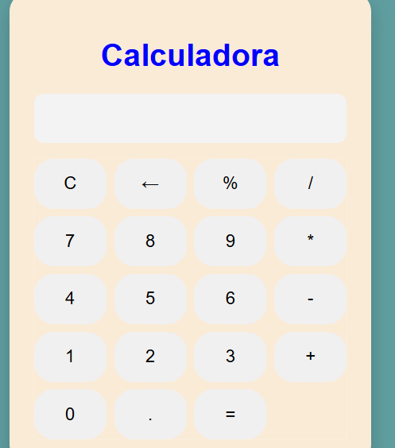

# Calculadora JS

Calculadora web desarrollada con HTML, CSS y JavaScript. Este proyecto permite realizar operaciones matemáticas básicas desde una interfaz sencilla, moderna y responsive.

## Funcionalidades

- Suma
- Resta
- Multiplicación
- División
- Porcentaje
- Limpieza de pantalla
- Borrado del último carácter
- Validación para evitar operadores repetidos
- Manejo básico de errores en operaciones incompletas

## Tecnologías utilizadas

- HTML5
- CSS3
- JavaScript

## Vista previa

Aquí puedes agregar una captura del proyecto:



## Estructura del proyecto
```text
calculadora-js/
│
├── index.html
├── styles.css
├── script.js
└── README.md
```
## Cómo ejecutar el proyecto

1. Clonar el repositorio:

git clone https://github.com/Daniel-blago/calculadora-js.git

2. Abrir la carpeta del proyecto:

cd calculadora-js

3. Abrir el archivo index.html en el navegador.

También se puede ejecutar usando la extensión Live Server en Visual Studio Code.

## Aprendizaje del proyecto

Este proyecto fue desarrollado con el objetivo de practicar la manipulación del DOM, eventos en JavaScript, uso de funciones, validaciones básicas y diseño web con CSS.

## Autor

Desarrollado por **Daniel Blacio**.

- GitHub: [Daniel-blago](https://github.com/Daniel-blago)
- LinkedIn: [Daniel Ansthon Blacio Godoy](https://ec.linkedin.com/in/daniel-ansthon-blacio-godoy-5a06ab22a)
